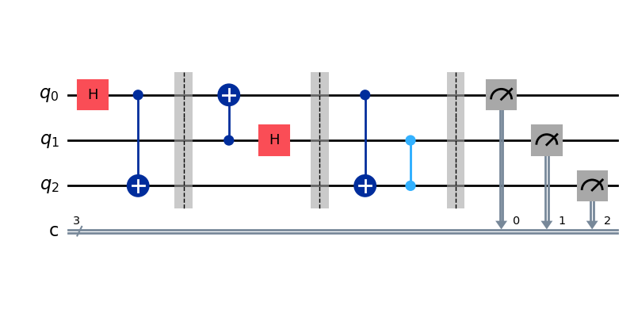

# Quantum Network EGT/DQT Simulation

This repository simulates quantum entanglement distribution using two key transduction strategies:  
**Entanglement Generation Transduction (EGT)** and **Direct Quantum Transduction (DQT)**.

The goal is to explore how these transduction strategies affect entanglement fidelity and distribution in a network setting, using ancilla-assisted teleportation and source-destination link modeling. This aligns with emerging challenges in distributed quantum computing and network emulation research.


## What This Project Simulates

- **EGT-based generation** of hybrid entanglement (using beam-splitter models)  
- **DQT-based entanglement distribution** and fidelity loss over noisy channels  
- **Ancilla qubit-assisted** teleportation protocols  
- **Source-destination link** archetypes from quantum networking theory  

## Tools and Technologies

- **Python:** 3.11  
- **Quantum:** Qiskit, Qiskit Aer (noisy simulation), PennyLane (optional extension)  
- **Plotting:** Matplotlib, Seaborn  
- **Numerics:** NumPy

## Repo Structure

quantum_network_egtdqt_simulation/
├── README.md
├── LICENSE
├── docs/
│ ├── architecture_diagram.png
│ └── simulation_results.png
├── scripts/
│ ├── draw_egtdqt_circuit.py
│ └── entanglement_simulator.py
└── data/
└── example_results.csv (optional)


---

## Architecture Diagram


---

## Circuit Diagram



---

## Getting Started

1. **Clone:**  
   `git clone https://github.com/FranziskaVansickle/quantum_network_egtdqt_simulation.git`  
2. **Install env:**  
   Use your pinned `requirements.in` workflow to set up `QuantumEnv`.  
3. **Simulate:**  
   ```bash
   python scripts/entanglement_simulator.py
